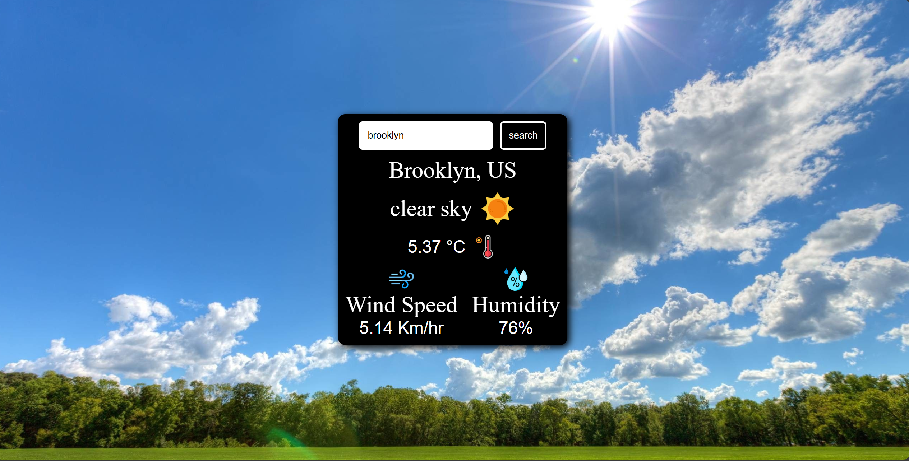

## 🌦 Weather on Web
A dynamic and responsive weather web app built with React and styled using plain CSS. The app fetches real-time weather data and updates the UI with dynamic background images based on the weather conditions of the selected location.

## 🚀 Features
✅ Real-time Weather Data – Fetches live weather details for any city.
✅ Dynamic Imaging – Changes background based on the current weather.
✅ Responsive Design – Works seamlessly on all devices.
✅ Built with React – Ensures smooth performance and reactivity.
✅ Styled with Plain CSS – Simple, lightweight, and efficient styling.

## 🔧 Technologies Used
React.js – Frontend framework
OpenWeather API – Fetches weather data
Plain CSS – Custom styling for a clean UI

## 📸 Preview
